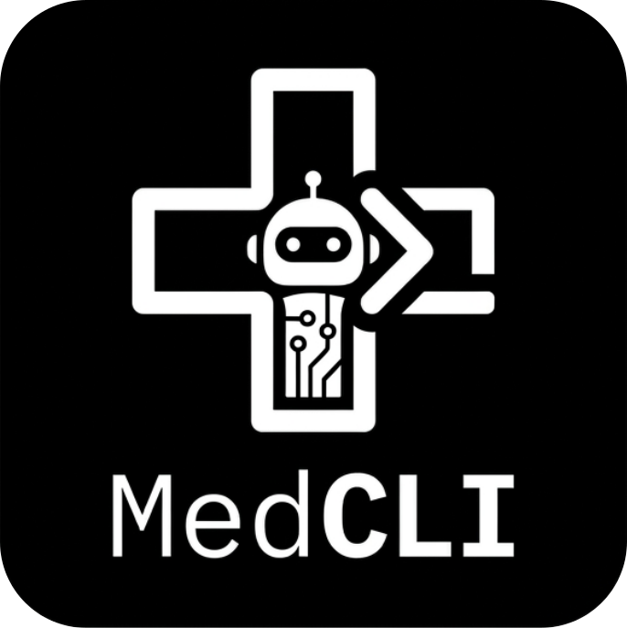

## Overview

MedCLI is a [Harbor](https://harborframework.com/)-first research project exploring how LLM agents can act as autonomous research assistants for healthcare.

The system centers on a **terminal-based** environment where agents can inspect clinical data, use tools, access medical resources, and iteratively reason through complex tasks. Through this interface, agents interact with EHR systems and common data models to explore data, answer questions, perform analyses, and take structured actions.

MedCLI is designed to study how agents can **understand and operate on real-world medical data systems** across tasks such as:

| Task | Description |
|------|-------------|
| **Schema understanding** | Explore and document EHR database structure (tables, schemas, relationships) |
| **Factual QA** | Answer data-grounded clinical questions with SQL + reasoning |
| **Cross-schema ETL** | Map source EHR to target CDM (OMOP, FHIR, MEDS) with validation |
| **Cohort construction** | Assemble patient cohorts from natural-language inclusion/exclusion criteria |
| **Outcome prediction** | Retrieve features, find similar patients, produce risk estimates with evidence |
| **Trajectory summarization** | Generate longitudinal clinical summaries for a given patient |
| **Temporal reasoning** | Answer multi-hop temporal queries with time-window logic |
| **Treatment pathway analysis** | Extract and visualize common treatment sequences for a condition |
| **Trial eligibility** | Assess clinical trial eligibility for a patient with structured evidence |
| **Medication reconciliation** | Compile active medications and flag drug interactions |
| **Data quality auditing** | Detect inconsistencies, missing values, and implausible entries |
| **Report generation** | Draft clinical documents (referral letters, discharge summaries) from data |
| **Data aggregation** | Aggregate multiple EHR measurements into computed summaries or trends |
| **Clinical data recording** | Record new observations or updates into the clinical chart via structured APIs |
| **Care ordering** | Place orders/referrals/tests with appropriate coded payloads and rationale |

## Harbor Background

This project uses Harbor as the terminal-task execution and evaluation substrate. Harbor provides a consistent trial lifecycle (agent run, verifier run, and artifacts), while MedCLI adds domain-specific health tasks, Harbor task environments, and benchmark integrations.

Important pointers:

1. Harbor repo: https://github.com/harbor-framework/harbor
2. Harbor docs/wiki: https://deepwiki.com/harbor-framework/harbor
3. Stable Harbor version used here: `0.3.0`
   - Upgrade caution: Harbor upgrades can break custom installed-agent integration interfaces such as `src/medcli/agents/harbor/installed/codex.py` and `src/medcli/agents/harbor/installed/copilot_cli.py`.
4. Local Harbor job configs in this repo include `jobs/example.yaml` and benchmark-specific job configs under `jobs/`.

## Project Structure

```text
MedCLI/
├── README.md
├── AGENTS.md
├── CLAUDE.md
├── PLANS.md
├── .agent/plans/               # ExecPlans, including Harbor migration and cleanup plans
├── design/                     # Design docs, brainstorm notes, and planning materials not yet executed in the project
├── paper/                      # Manuscript draft, paper framing, and later paper-writing materials such as LaTeX sources
├── tasks/<benchmark>/          # Generated Harbor task for a benchmark
├── jobs/                       # Harbor job configs
├── debug/                      # Generic Harbor-oriented debug helpers and docs
├── src/medcli/
│   └── agents/harbor/installed/ # Harbor installed-agent wrappers
├── scripts/<benchmark>/        # Benchmark-specific setup, generation, and evaluation helpers
├── results/                    # Run and evaluation artifacts (gitignored)
└── tests/
```

## Setup

```bash
# Clone the repo
git clone git@github.com:sheng-z/MedCLI.git
cd MedCLI

# Install dependencies
uv sync --all-extras
```

Python version requirement: `>=3.12`.

## Usage

See `tasks/README.md` for the full list of currently supported tasks and benchmarks.

```bash
# Ensure Codex auth exists locally
codex login status

uv run harbor run -c jobs/<benchmark>.yaml
```

## Task Creation

For benchmark-specific task creation details, see `scripts/<benchmark>/README.md`.

## Debug

For generic Harbor debug workflow details, see `debug/README.md`.

For benchmark-specific debug workflow details, see `debug/<benchmark>/README.md`.

## License

TBD
