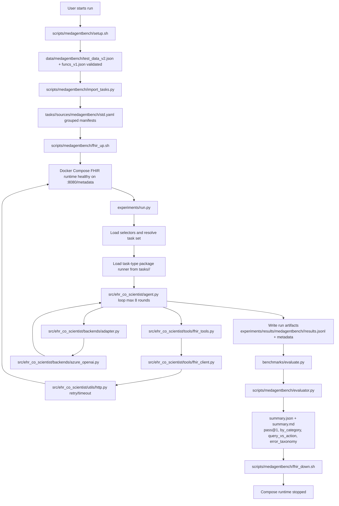

# MedAgentBench Execution Workflow

```mermaid
flowchart TD
    A[User starts run] --> B[scripts/medagentbench/setup.sh]
    B --> C[data/medagentbench/test_data_v2.json + funcs_v1.json validated]
    C --> D[scripts/medagentbench/import_tasks.py]
    D --> E[tasks/<task_type>/sources/medagentbench/std.yaml grouped manifests]

    E --> F[scripts/medagentbench/fhir_up.sh]
    F --> G[Docker Compose FHIR runtime healthy on :8080/metadata]

    G --> H[experiments/run.py]
    H --> I[Load selectors and resolve task set]
    I --> J[Load task-type package runner from tasks/<task_type>/]
    J --> K[src/ehr_co_scientist/agent.py loop max 8 rounds]

    K --> L[src/ehr_co_scientist/tools/fhir_tools.py]
    L --> M[src/ehr_co_scientist/tools/fhir_client.py]
    M --> N[src/ehr_co_scientist/utils/http.py retry/timeout]
    N --> G

    K --> O[src/ehr_co_scientist/backends/adapter.py]
    O --> P[src/ehr_co_scientist/backends/azure_openai.py]
    P --> K

    K --> Q[Write run artifacts\nexperiments/results/medagentbench/<run-id>/results.jsonl + metadata]
    Q --> R[benchmarks/evaluate.py]
    R --> S[scripts/medagentbench/evaluator.py]
    S --> T[summary.json + summary.md\npass@1, by_category, query_vs_action, error_taxonomy]

    T --> U[scripts/medagentbench/fhir_down.sh]
    U --> V[Compose runtime stopped]
```
